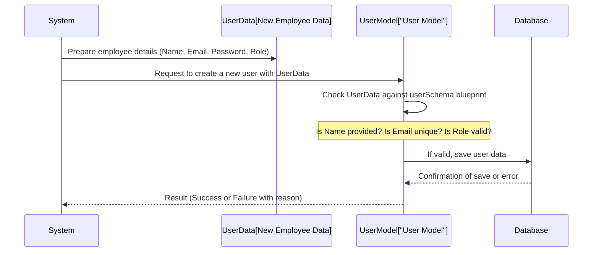

# Chapter 1: User Data Model

Welcome to the first chapter of our tutorial on building an Inventory Management System! In this chapter, we'll start with a fundamental concept: the **User Data Model**.

Think of a data model like a **blueprint** or a **template**. Just as a builder uses a blueprint to know where the walls, doors, and windows go in a house, our application uses a data model to know what information it needs to store about something, in this case, a **user**.

## Why Do We Need a User Data Model?

Imagine our Inventory Management System needs to know who is logging in, what they are allowed to do (like add new items or just view inventory), and how to contact them (like their email address). To keep track of all this information for potentially many users, we need a structured way to store it.

The User Data Model provides this structure. It answers questions like: "What pieces of information _must_ every user account have?"

Let's consider a simple use case: **Creating a new employee account**. When a new staff member joins, we need to set them up with access. What information do we need from them? Their name, how they'll log in (their email), a way for them to secure their account (a password), and what kind of access they should have (are they a regular 'staff' member or an 'admin' who can do everything?).

The User Data Model is the blueprint that tells us exactly what boxes we need to fill in when we create this new account.

## Breaking Down the User Blueprint

Let's look at the blueprint for a user account in our system. Our User Data Model defines these key pieces of information:

- **Name:** The user's full name. Pretty straightforward!
- **Email:** This is super important. It's usually used as the unique way to identify and log in a user. Think of it like a unique key for a house – no two users can have the same email address.
- **Password:** The secret code the user uses to prove they are who they say they are when logging in. It needs to be stored securely (we'll talk more about security later!).
- **Role:** This defines what the user is allowed to do in the system. In our case, users will either be an 'admin' (who has full control) or 'staff' (who might have more limited access).

So, for our new employee account, we'd collect their Name, Email, and a starting Password, and assign them a Role (probably 'staff' initially).

## How the Blueprint Looks in Code

In our project, we are using a database technology called MongoDB, and we use a tool called Mongoose to help us define these blueprints (or "schemas" as they are often called).

Let's look at the code file that defines our User Data Model: `server/models/User.js`.

```javascript
// importing all packages
import mongoose from "mongoose";

// User Schema Configuration
const userSchema = new mongoose.Schema({
  name: { type: String, required: [true, "Name is required"] },
  email: { type: String, unique: true, required: [true, "Email is required"] },
  password: { type: String, required: [true, "Password is required"] },
  role: { type: String, enum: ["admin", "staff"], default: "staff" },
});

// User model creating
const User = mongoose.model("User", userSchema);

// Exporting User
export default User;
```

Okay, let's break down what this code is doing, piece by piece:

1.  `import mongoose from "mongoose";`: This line just says we want to use the Mongoose tool.
2.  `const userSchema = new mongoose.Schema({...});`: This is where we draw our blueprint! `mongoose.Schema` is the function that helps us define the structure. Inside the curly braces `{}` is where we list all the pieces of information for our user.
3.  Inside the `userSchema`:
    - `name: { type: String, required: [true, "Name is required"] }`: This line defines the 'Name' field.
      - `type: String`: It says the name should be text.
      - `required: [true, "Name is required"]`: It says this field _cannot_ be empty when creating a user. If you try to create a user without a name, Mongoose will give an error with the message "Name is required".
    - `email: { type: String, unique: true, required: [true, "Email is required"] }`: This defines the 'Email' field.
      - `type: String`: It's text.
      - `unique: true`: This is important! It enforces our rule that no two users can have the same email. Mongoose and the database will make sure of this.
      - `required: [true, "Email is required"]`: You _must_ provide an email.
    - `password: { type: String, required: [true, "Password is required"] }`: Defines the 'Password' field.
      - `type: String`: It's text.
      - `required: [true, "Password is required"]`: You _must_ provide a password.
    - `role: { type: String, enum: ["admin", "staff"], default: "staff" }`: Defines the 'Role' field.
      - `type: String`: It's text.
      - `enum: ["admin", "staff"]`: This is a special rule! It says the `role` field can _only_ be one of these two specific text values: `"admin"` or `"staff"`. You can't accidentally set a role like `"manager"` or `"guest"`.
      - `default: "staff"`: If you create a new user but don't specify a role, it will automatically be set to `"staff"`.
4.  `const User = mongoose.model("User", userSchema);`: After defining the `userSchema` blueprint, this line creates a usable "Model" from it. We call it `User`. This `User` model is what we'll actually use in other parts of our code to interact with the database (like creating, finding, or updating user accounts). The first argument `"User"` is the name Mongoose will use for the collection (like a table) in the database.
5.  `export default User;`: This makes our `User` model available to be used in other parts of our application.

## How it Works When You Create a User (Conceptual Flow)

Let's see conceptually what happens when we use this `User` model to create a new user account for our new employee.



In this diagram:

1.  The `System` (our application code) gathers the details for the new employee.
2.  The `System` tells the `User Model` to create a new user using this data.
3.  The `User Model` (using the `userSchema` blueprint) checks if the data is valid – does it have a name, a unique email, a password, and a valid role?
4.  If everything looks good, the `User Model` sends the data to the `Database` to be saved.
5.  The `Database` confirms if it saved successfully or if there was an error (like trying to use an email that already exists).
6.  The `User Model` reports the result back to the `System`.

This shows how the `userSchema` acts as a validator and structure guide before the information is stored.

## Conclusion

The User Data Model, defined in `server/models/User.js` using Mongoose, is our fundamental blueprint for user accounts. It specifies the required fields (name, email, password) and rules (email must be unique, role must be 'admin' or 'staff'). This structured approach ensures that all user data in our system is consistent and complete, which is crucial for features like authentication and authorization later on.

Now that we have a blueprint for users, let's move on to defining the blueprint for the items our system will manage!

[Next Chapter: Inventory Data Model](02_inventory_data_model.md)
