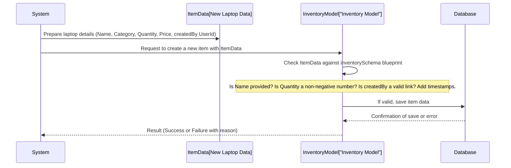

# Chapter 2: Inventory Data Model

Welcome back to our tutorial on building an Inventory Management System! In [Chapter 1: User Data Model](01_user_data_model.md), we learned about the blueprint for storing information about the people who use our system (users). Now, it's time to define the blueprint for the _stuff_ our system is actually managing: the **Inventory Data Model**.

Just like the User Data Model gives structure to user information, the Inventory Data Model gives structure to the information about every single item we want to track in our inventory.

## Why Do We Need an Inventory Data Model?

Imagine our Inventory Management System needs to keep track of thousands of different items – laptops, monitors, keyboards, maybe even office supplies. For each item, we need to know key details: What is it called? What kind of item is it (its category)? How many do we have? How much does it cost? Who even added this item to our list in the first place?

To manage all this information consistently and efficiently, we need a clear, defined structure for _each_ inventory item record.

The Inventory Data Model provides this structure. It answers questions like: "What pieces of information _must_ every inventory item have?"

Let's consider a simple use case: **Adding a new laptop model to the inventory.** When a new shipment of laptops arrives, we need to add them to our system so we know they're available. What information do we need to record for this new laptop model? Its name (e.g., "AcmeCorp Laptop X"), what category it belongs to ("Electronics"), how many we received (e.g., 50), how much one costs (e.g., $1200), and who is responsible for adding it (maybe the logistics manager, whose user account is in our system).

The Inventory Data Model is the blueprint that tells us exactly what boxes we need to fill in when we add this new laptop model.

## Breaking Down the Inventory Blueprint

Let's look at the blueprint for an inventory item in our system. Our Inventory Data Model defines these key pieces of information:

- **Name:** The specific name of the item (e.g., "AcmeCorp Laptop X", "Ergo Mouse Pro").
- **Category:** A broader group the item belongs to (e.g., "Electronics", "Office Supplies", "Furniture"). This helps in organizing and searching.
- **Quantity:** How many of this specific item are currently in stock. This is a number.
- **Price:** The cost of one unit of this item. This is also a number.
- **createdBy:** This is special! It's not just text or a number. It's a link or reference to the user who added this item to the system. Why? So we can track who made changes or additions.
- **Timestamps:** The system will automatically record when the item was created and last updated. This is useful for tracking changes over time.

So, for our new laptop model, we'd record its Name, Category, starting Quantity, Price, and link it to the user account of the person who added it.

## How the Blueprint Looks in Code

Just like with the User Data Model, we use Mongoose in our project to define this blueprint (or "schema") for inventory items.

Let's look at the code file that defines our Inventory Data Model: `server/models/Inventory.js`.

```javascript
// importing all packages
import mongoose from "mongoose";

// Inventory Schema Configuration
const inventorySchema = new mongoose.Schema(
  {
    name: {
      type: String,
      required: [true, "Item name is required"],
    },
    category: {
      type: String,
      required: [true, "Category is required"],
    },
    quantity: {
      type: Number,
      required: [true, "Quantity is required"],
      min: [0, "Quantity cannot be negative"],
    },
    price: {
      type: Number,
      required: [true, "Price is required"],
      min: [0, "Price cannot be negative"],
    },
    createdBy: {
      type: mongoose.Schema.Types.ObjectId,
      ref: "User",
      required: true,
    },
  },
  { timestamps: true } // This adds createdAt and updatedAt fields automatically
);

const Inventory = mongoose.model("Inventory", inventorySchema);

export default Inventory;
```

Okay, let's break down this code, focusing on the differences and similarities compared to the User schema:

1.  `import mongoose from "mongoose";`: We still need Mongoose.
2.  `const inventorySchema = new mongoose.Schema({...}, { timestamps: true });`: This is where we draw the blueprint for an inventory item. Notice the second argument `{ timestamps: true }`. This is a Mongoose option that automatically adds two fields: `createdAt` (when the item was added) and `updatedAt` (when the item was last changed). Very handy!
3.  Inside the `inventorySchema`:
    - `name: { type: String, required: [true, "Item name is required"] }`: Defines the 'Name' field. It's text (`String`) and must be provided (`required`).
    - `category: { type: String, required: [true, "Category is required"] }`: Defines the 'Category' field. It's text (`String`) and must be provided (`required`).
    - `quantity: { type: Number, required: [true, "Quantity is required"], min: [0, "Quantity cannot be negative"] }`: Defines the 'Quantity' field.
      - `type: Number`: It says the quantity must be a number.
      - `required: [true, "Quantity is required"]`: It must be provided.
      - `min: [0, "Quantity cannot be negative"]`: This is a validation rule! It ensures the quantity cannot be a negative number. You can't have less than zero items!
    - `price: { type: Number, required: [true, "Price is required"], min: [0, "Price cannot be negative"] }`: Defines the 'Price' field.
      - `type: Number`: It must be a number.
      - `required: [true, "Price is required"]`: It must be provided.
      - `min: [0, "Price cannot be negative"]`: Similar to quantity, the price cannot be negative.
    - `createdBy: { type: mongoose.Schema.Types.ObjectId, ref: "User", required: true, }`: Defines the 'createdBy' field.
      - `type: mongoose.Schema.Types.ObjectId`: This tells Mongoose and MongoDB that this field will store a special ID that uniquely identifies another document in a _different_ collection. It's like storing the unique "address" of the user who created this item.
      - `ref: "User"`: This is the crucial part for linking! It tells Mongoose that the `ObjectId` stored here _refers_ to a document in the "User" collection (the one defined by our [User Data Model](01_user_data_model.md)). This allows us to easily find the user associated with an inventory item.
      - `required: true`: You must link this item to a user who created it.
4.  `const Inventory = mongoose.model("Inventory", inventorySchema);`: This creates the usable "Model" called `Inventory` from our `inventorySchema` blueprint. We'll use this `Inventory` model in our code to interact with the database (add new items, find items, update quantities, etc.).
5.  `export default Inventory;`: This makes our `Inventory` model available for use elsewhere in the application.

## How it Works When You Add an Item (Conceptual Flow)

Let's see conceptually what happens when we use this `Inventory` model to add a new laptop model to the inventory list.



In this diagram:

1.  The `System` (our application code) gathers the details for the new laptop item, including the ID of the user who is adding it.
2.  The `System` tells the `Inventory Model` to create a new item using this data.
3.  The `Inventory Model` (using the `inventorySchema` blueprint) checks if the data is valid – does it have all the required fields? Are numbers non-negative? Is the `createdBy` field linked to a user? Mongoose also automatically adds the `createdAt` and `updatedAt` timestamps.
4.  If everything looks good, the `Inventory Model` sends the data to the `Database` to be saved.
5.  The `Database` confirms if it saved successfully or if there was an error (like missing a required field).
6.  The `Inventory Model` reports the result back to the `System`.

This shows how the `inventorySchema` ensures that every item record added to our database follows the same rules and structure, including correctly linking back to the user who added it.

## Conclusion

The Inventory Data Model, defined in `server/models/Inventory.js` using Mongoose, is our blueprint for every item we track in the system. It specifies essential details like name, category, quantity, and price, and includes validation rules (like non-negative numbers). Importantly, it uses a special field (`createdBy`) to link each item record back to the user who created it, leveraging the [User Data Model](01_user_data_model.md) we defined earlier. This structure is vital for managing inventory effectively and knowing the history of each item.

With blueprints for both users and inventory items now defined, we have the core structure for our data. Next, we'll explore how users prove who they are to the system using authentication!

[Next Chapter: User Authentication & Authorization Flow](03_user_authentication_authorization_flow.md)
