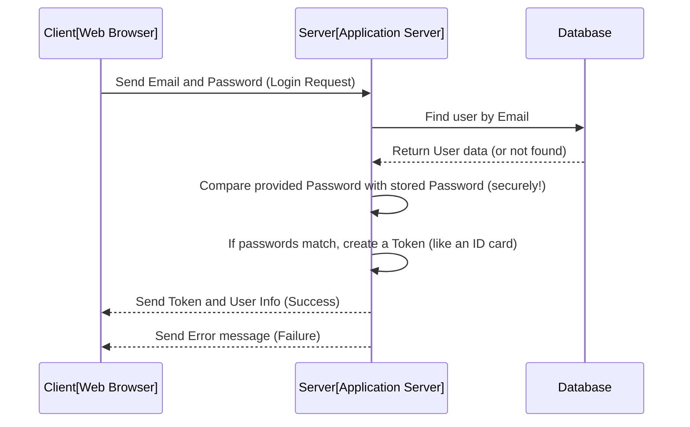

# Chapter 3: User Authentication & Authorization Flow

Welcome back! In the previous chapters, we designed the blueprints for the data our system will manage: [Chapter 1: User Data Model](01_user_data_model.md) for _who_ uses the system and [Chapter 2: Inventory Data Model](02_inventory_data_model.md) for _what_ the system tracks.

Now, let's tackle a crucial aspect of any real-world application: security! How do we make sure only the right people can access the system, and once they are in, how do we control what they are allowed to see or change? This is where **User Authentication** and **Authorization** come in.

Think of our Inventory Management System like a secure building:

- **Authentication:** This is like showing your ID at the front desk. It's the process of **proving who you are**. When you log in with your email and password, you are authenticating yourself.
- **Authorization:** This is like the access level programmed into your ID card or the keys you are given. Once you're _inside_ the building (authenticated), this determines **what parts of the building you can access** and **what actions you can perform** (e.g., only managers can open the supply closet, but everyone can use the break room).

In our application, this flow controls user login, protects certain pages or actions, and restricts abilities based on whether a user is an 'admin' or 'staff'.

## The Core Use Case: Logging In

The most common example of authentication is logging in. Let's trace what happens when a user tries to access our system by providing their email and password.

The goal is to:

1.  Verify the user's identity (Authentication).
2.  If successful, give them something that proves they are logged in (a token).
3.  Allow them access to parts of the system.

## Authentication: Proving Who You Are (Login)

When you enter your email and password on a login screen and click "Submit," this information is sent to the server.

Here's a simplified view of what happens on the server side during login:



Let's look at the code that handles this login process on our server. This is typically found in a file like `server/controller/authController.js`.

```javascript
// ... other imports and setup ...
import User from "../models/User.js"; // Import our User blueprint

// LOGIN function
export const loginUser = async (req, res) => {
  const { email, password } = req.body; // Get email and password from the request

  try {
    // 1. Find the user in the database using the email
    const user = await User.findOne({ email });
    if (!user) {
      // If user not found, send an error
      return res.status(404).json({ message: "User not found" });
    }

    // 2. Compare the provided password with the stored password
    // We use bcrypt.compare because passwords are encrypted (hashed) in the database
    const isMatch = await bcrypt.compare(password, user.password);
    if (!isMatch) {
      // If passwords don't match, send an error
      return res.status(401).json({ message: "Invalid Credentials" });
    }

    // 3. If email and password are correct, create a JWT token
    // This token contains basic user info (like ID and role) and is signed
    const token = jwt.sign({ id: user._id, role: user.role }, JWT_SECRET, {
      expiresIn: "1d", // The token is valid for 1 day
    });

    // 4. Send the token and some basic user info back to the client
    return res.status(200).json({
      token,
      user: { id: user._id, name: user.name, role: user.role },
    });
  } catch (err) {
    // Handle any other errors
    return res.status(500).json({ message: err.message });
  }
};
```

**Explanation:**

- The code receives the `email` and `password` sent by the user.
- It uses the `User` model (our blueprint from [Chapter 1: User Data Model](01_user_data_model.md)) to find a user in the database with that email.
- If a user is found, it _securely_ compares the provided password with the password stored in the database using `bcrypt.compare`. Passwords are never stored in plain text for security reasons!
- If the passwords match, the server knows the user is authentic. It then creates a **JSON Web Token (JWT)** using the `jsonwebtoken` library. This token is like a temporary, signed ID card that contains basic information about the user (like their unique ID and their `role` - 'admin' or 'staff').
- This token is sent back to the client (the web browser), along with some non-sensitive user details like their name and role.
- If anything goes wrong (user not found, wrong password), an error message is sent back.

## The Token: Your Temporary ID Card

Once the client receives the token from a successful login, it's crucial. The client will store this token (we'll see how in the next chapter, [Auth Context (Client State Management)](04_auth_context_client_state_management.md)).

Why is the token important? Because for almost _every_ request the client makes to the server to access protected information or perform actions (like fetching the inventory list or adding a new item), the client will include this token. It's like showing your ID card every time you enter a restricted area in the building.

## Authorization: What You're Allowed To Do

Now that the user is logged in and has their token, the server needs a way to check:

1.  **Is this request coming from a _logged-in_ user?** (Protecting routes/endpoints)
2.  **Is this specific user _allowed_ to perform this specific action?** (Based on their role)

This is Authorization.

### Protecting Routes (General Access)

Many parts of our application should only be accessible if you are logged in. For example, you shouldn't be able to view the inventory list or add new items unless you've authenticated first.

On the server side, we use something called **middleware** to check the token before allowing a request to proceed to the part of the code that handles the actual request (like fetching inventory).

Look at the code in `server/middleware/authMiddleware.js`:

```javascript
// ... imports and setup ...
import jwt from "jsonwebtoken"; // Need this to verify the token

// Middleware function to verify the token
export const verifyToken = (req, res, next) => {
  // Get the token from the 'Authorization' header (where clients usually send it)
  const authHeader = req.headers.authorization;

  // 1. Check if the header exists and starts with "Bearer "
  if (!authHeader || !authHeader.startsWith("Bearer ")) {
    return res
      .status(401) // 401 means Unauthorized
      .json({ message: "Access denied. No token provided." });
  }

  // 2. Extract the token string (remove "Bearer ")
  const token = authHeader.split(" ")[1];

  try {
    // 3. Verify the token using the secret key
    const decoded = jwt.verify(token, JWT_SECRET);
    // If verification is successful, 'decoded' contains the info we put in the token (like user ID and role)

    // 4. Attach the decoded user info to the request object
    req.user = decoded;

    // 5. Call next() to allow the request to proceed to the next handler
    next();
  } catch (err) {
    // If verification fails (e.g., token is invalid or expired)
    return res.status(401).json({ message: err.message });
  }
};
```

**Explanation:**

- This `verifyToken` function is designed to be run _before_ the code that handles a specific server request (like getting inventory data).
- It checks the `Authorization` header sent by the client, expecting the token in a specific format (`Bearer [the actual token]`).
- It extracts the token string.
- It uses `jwt.verify` to check if the token is valid and hasn't been tampered with, using the same secret key (`JWT_SECRET`) that was used to sign it during login.
- If the token is valid, `jwt.verify` gives us the original information stored in the token (the user's ID and role). This information is then attached to the `req.user` object, making it available to the actual request handler.
- `next()` tells the server to continue processing the request (e.g., go get the inventory data).
- If the header is missing, the token format is wrong, or the token is invalid, the middleware stops the request and sends a `401 Unauthorized` error back to the client.

This middleware is applied to specific routes that should be protected. For example, a route to get the inventory list might be set up like this (conceptually, using Express.js syntax):

```javascript
// ... imports ...
import { verifyToken } from "../middleware/authMiddleware.js";
import { getAllInventoryItems } from "../controller/inventoryController.js"; // Assuming an inventory controller

router.get("/inventory", verifyToken, getAllInventoryItems); // This route now requires a valid token
```

Here, `verifyToken` runs first. If it passes, `getAllInventoryItems` runs. If `verifyToken` fails, `getAllInventoryItems` is never called, and the client gets a 401 error.

On the client side, we also prevent users from even _seeing_ certain pages if they aren't logged in. This is handled by components like `ProtectedRoute.jsx`.

```javascript
import { Navigate } from "react-router-dom";
import { useAuth } from "../context/AuthContext"; // We'll cover this in the next chapter!

const ProtectedRoute = ({ children }) => {
  // Get the token from wherever it's stored on the client (the Auth Context)
  const { token } = useAuth();

  // If there's no token, redirect the user to the login page
  if (!token) {
    return <Navigate to={"/login"} replace />;
  }

  // If there is a token, render the requested content
  return children;
};

export default ProtectedRoute;
```

**Explanation:**

- This React component wraps content that should only be visible to logged-in users.
- It checks if a `token` exists in the client's state (using `useAuth()`, which we'll explain in the next chapter).
- If there's no token, it uses `react-router-dom`'s `Navigate` component to redirect the user to the `/login` page.
- If a token _does_ exist, it renders whatever was inside the `ProtectedRoute` tags (`{ children }`).

### Role-Based Access Control (Specific Actions)

Protecting routes ensures only logged-in users get in. But what about controlling _what_ they can do? This is where Authorization based on the user's `role` comes in.

Remember our `role` field in the [User Data Model](01_user_data_model.md)? We have 'admin' and 'staff' roles. Admins might be allowed to add or delete inventory items, while staff might only be allowed to view the list.

Since the `verifyToken` middleware attaches the user's `role` (extracted from the token) to `req.user`, the code that handles specific actions can check this role.

For example, a server function to _delete_ an inventory item might look conceptually like this (this specific code is not provided in the snippets but is a common pattern):

```javascript
// Inside a controller function that handles deleting an item
export const deleteInventoryItem = async (req, res) => {
  // After verifyToken middleware runs, req.user contains { id: ..., role: ... }

  // Check if the logged-in user's role is 'admin'
  if (req.user.role !== "admin") {
    // If not admin, they are not authorized to delete
    return res.status(403).json({ message: "Forbidden. Admins only." }); // 403 means Forbidden
  }

  // If they are an admin, proceed with the deletion logic...
  try {
    // ... find and delete the item by ID ...
    // return success message
  } catch (err) {
    // ... handle errors ...
  }
};
```

In this conceptual example, the code explicitly checks `req.user.role`. If it's not 'admin', it sends a `403 Forbidden` error, preventing the user from deleting the item even if they are logged in (`authenticated`).

This pattern of checking `req.user.role` after `verifyToken` middleware is how we implement role-based authorization for specific actions on the server.

## Summary: Authentication vs. Authorization

Let's quickly summarize the difference:

| Feature         | Authentication                           | Authorization                                                       |
| :-------------- | :--------------------------------------- | :------------------------------------------------------------------ |
| **Question**    | Who are you? (Proving identity)          | What are you allowed to do? (Permissions)                           |
| **Example**     | Logging in with email/password           | Viewing inventory, adding items, deleting items                     |
| **Mechanism**   | Checking credentials, Issuing a token    | Checking the token, Checking user roles                             |
| **Server Code** | `loginUser` function in `authController` | `verifyToken` middleware, checking `req.user.role` in controllers   |
| **Client Code** | Sending login data                       | Using `ProtectedRoute`, potentially showing/hiding UI based on role |

## Conclusion

In this chapter, we explored the critical flow of User Authentication and Authorization. We saw how users log in by providing credentials, how the server verifies their identity and issues a token (like a temporary ID), and how this token is then used by middleware (`verifyToken`) to protect server routes. We also touched upon how the user's role (stored in the token and accessed via `req.user`) is used on the server to decide if they are authorized to perform specific actions, providing different levels of access for 'admin' and 'staff'. On the client side, a component like `ProtectedRoute` helps ensure that parts of the application are only accessible if the user has a valid token.

Understanding this flow is fundamental to building secure applications. Now that we know how authentication and authorization work on the server, let's see how we manage the user's logged-in state and token on the client side using an Auth Context.

[Next Chapter: Auth Context (Client State Management)](04_auth_context_client_state_management.md)
