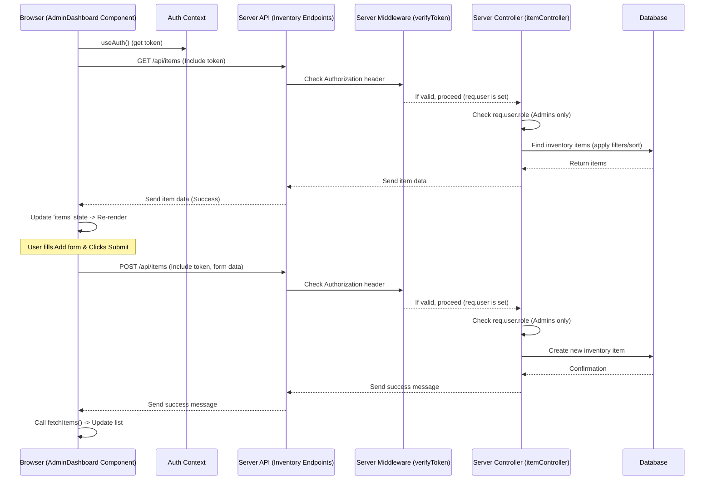

# Chapter 6: Admin Inventory Interface

Welcome back! In our last chapter, [Client-Side Routing](05_client_side_routing.md), we set up the navigation system for our frontend application, allowing users to move between different "pages" like Login, Register, and Dashboard without full page reloads. We also saw how to protect routes based on the user's login status using the [Auth Context](04_auth_context_client_state_management.md).

Now that an administrator can successfully log in and navigate to their designated area, it's time to build the core workspace where they will perform their main task: managing the inventory items. This brings us to the **Admin Inventory Interface**.

## What is the Admin Inventory Interface?

Think of this as the administrator's **control panel** for everything related to inventory items. It's a dedicated page in the application designed specifically for admins to see, organize, and modify the list of items in the warehouse.

The main problem this interface solves is providing a user-friendly way for administrators to perform all necessary inventory management actions directly within the application, interacting with the data stored according to our [Inventory Data Model](02_inventory_data_model.md) and [User Data Model](01_user_data_model.md).

## Core Use Case: Managing Inventory Items

The central purpose of this interface is to empower administrators to:

1.  **View** the complete list of inventory items.
2.  **Search, Filter, and Sort** the list to find specific items quickly.
3.  **Add** new items to the inventory.
4.  **Edit** the details (like quantity, price, or category) of existing items.
5.  **Delete** items from the inventory.

This page needs to handle displaying data, taking user input for new items or edits, and communicating these changes back to the server.

## Key Concepts of the Interface

The Admin Inventory Interface (`AdminDashboard.jsx`) combines several concepts we've touched upon:

1.  **Fetching Data:** It needs to load the list of inventory items from the server when the page loads and whenever changes are made (like adding or deleting an item).
2.  **Displaying Data:** The fetched items need to be presented in a clear, organized way, typically in a table.
3.  **Forms & Inputs:** Input fields and forms are needed for adding new items and for editing existing ones.
4.  **User Interaction:** Buttons for actions like "Add Item", "Edit", "Delete", and controls for "Search", "Filter", and "Sort" are crucial.
5.  **Client-Server Communication:** The interface makes requests (GET, POST, PUT, DELETE) to the server's API to perform the management tasks. These requests must include the user's authentication token from the [Auth Context](04_auth_context_client_state_management.md) to be authorized ([User Authentication & Authorization Flow](03_user_authentication_authorization_flow.md)).
6.  **State Management (Local):** The component needs to manage its own local state, such as the list of items being displayed, the values in the "Add Item" form, which item is currently being edited, and the criteria for searching/filtering/sorting.
7.  **Authorization Check (Client-Side):** Although server-side authorization is the primary guard, the component should also check the user's role from the [Auth Context](04_auth_context_client_state_management.md) to ensure only admins can even see and interact with this interface, leveraging the navigation protection from [Client-Side Routing](05_client_side_routing.md).

## How it Looks in Code (`client/src/pages/AdminDashboard.jsx`)

The core of the Admin Inventory Interface is the `AdminDashboard` component. Let's look at the structure and key parts of its code.

First, the imports and state setup:

```javascript
import { useEffect, useState } from "react";
import { useAuth } from "../context/AuthContext"; // To get user & token
import { useNavigate } from "react-router-dom"; // For redirection

const AdminDashboard = () => {
  const { user, token } = useAuth(); // Get logged-in user and token
  const navigate = useNavigate(); // Get navigate function

  // State for the list of items
  const [items, setItems] = useState([]);
  const [loading, setLoading] = useState(true); // Loading state for fetch

  // State for the "Add New Item" form
  const [formData, setFormData] = useState({
    name: "",
    category: "",
    quantity: "",
    price: "",
  });

  // State for handling errors from server requests
  const [error, setError] = useState("");

  // State for tracking which item is being edited and its form data
  const [editingItemId, setEditingItemId] = useState(null);
  const [editForm, setEditForm] = useState({
    name: "",
    category: "",
    quantity: "",
    price: "",
  });

  // State for search, filter, and sort inputs
  const [filters, setFilters] = useState({
    search: "",
    category: "",
    minPrice: "",
    maxPrice: "",
    minQty: "",
    maxQty: "",
    sort: "createdAt",
    order: "desc",
  });

  // ... rest of the component logic (useEffect, handlers, JSX) ...
};

export default AdminDashboard;
```

**Explanation:**

- We import necessary hooks from React (`useEffect`, `useState`), `useAuth` from our [Auth Context](04_auth_context_client_state_management.md), and `useNavigate` from `react-router-dom` for redirection.
- We get the `user` object and `token` using `useAuth()`. These are essential for checking the admin role and making authenticated API calls.
- We set up various state variables:
  - `items`: An array to hold the inventory data fetched from the server.
  - `loading`: A boolean to show a loading message while fetching data.
  - `formData`: An object to store the values typed into the "Add New Item" form fields.
  - `error`: A string to display any error messages received from the server.
  - `editingItemId`: Stores the ID of the item currently being edited (or `null` if none).
  - `editForm`: An object to store the values typed into the edit form fields when editing an item.
  - `filters`: An object to store the values from the search, filter, and sort input fields.

### Authorization Check

Even though the route might be protected by `ProtectedRoute`, this component adds an extra check using the user's role from the context:

```javascript
// Redirect if user is not an admin
useEffect(() => {
  if (!user || user.role !== "admin") {
    navigate("/login"); // Or maybe "/dashboard" for staff
  }
}, [user, navigate]); // Rerun this effect if user or navigate changes
```

**Explanation:**

- This `useEffect` hook runs when the component mounts or when the `user` object changes.
- It checks if `user` is null (not logged in) or if `user.role` is not `"admin"`.
- If either is true, it uses `navigate` to redirect the user to the login page. This provides a fallback authorization check client-side.

### Fetching Inventory Data

This function retrieves the list of items from the server, applying any filters or sorting settings.

```javascript
// Function to fetch items from the backend
const fetchItems = async () => {
  // Construct query parameters from the filters state
  const queryParams = new URLSearchParams(filters).toString();
  setLoading(true); // Set loading state before fetching

  try {
    const res = await fetch(`http://localhost:5000/api/items?${queryParams}`, {
      headers: {
        // Include the authentication token in the headers
        Authorization: `Bearer ${token}`,
      },
    });

    const data = await res.json();

    if (!res.ok) {
      // If server responds with an error status
      throw new Error(data.message || "Failed to fetch items");
    }

    setItems(data.items); // Update items state with fetched data
    setError(""); // Clear any previous errors
  } catch (err) {
    console.error("Fetch error:", err.message);
    setError(`Failed to load items: ${err.message}`); // Set error state
    setItems([]); // Clear items on error
  } finally {
    setLoading(false); // Always set loading to false when done
  }
};

// Fetch items when the component mounts or token changes, or filters change
useEffect(() => {
  // Only fetch if user is logged in and is admin (token check implies this)
  if (token) {
    fetchItems();
  }
}, [token, filters]); // Dependencies: rerun if token or filters change
```

**Explanation:**

- `fetchItems` is an asynchronous function that makes an API call.
- `URLSearchParams(filters).toString()` takes the object in our `filters` state (like `{ search: "laptop", category: "Electronics" }`) and turns it into a string like `search=laptop&category=Electronics` to be appended to the URL as query parameters.
- We use the standard `fetch` API to make a `GET` request to the `/api/items` endpoint on our server.
- Crucially, we include the `Authorization: Bearer ${token}` header. This sends the token obtained from the [Auth Context](04_auth_context_client_state_management.md) with the request, allowing the server's `verifyToken` middleware ([Chapter 3](03_user_authentication_authorization_flow.md)) to authenticate the request.
- After getting the response, we check `res.ok`. If the status code indicates success, we parse the JSON data (`data.items`) and update the `items` state, which causes the component to re-render with the new list.
- If there's an error (either from the server or the network), we catch it, log it, set the `error` state to display a message, and clear the `items`.
- The `useEffect` hook calls `fetchItems` when the component first loads (`[]` dependency array conceptually, but here we use `[token, filters]` to refetch when filters change or token becomes available after login).

### Handling User Input

Functions to update the component's state when the user types into input fields.

```javascript
// Handler for the "Add New Item" form inputs
const handleChange = (e) => {
  setFormData((prev) => ({
    ...prev, // Keep existing formData
    [e.target.name]: e.target.value, // Update the field that changed
  }));
};

// Handler for the Edit form inputs
const handleEditChange = (e) => {
  setEditForm((prev) => ({
    ...prev, // Keep existing editForm
    [e.target.name]: e.target.value, // Update the field that changed
  }));
};

// Handler for Search/Filter/Sort inputs
const handleFilterChange = (e) => {
  setFilters((prev) => ({
    ...prev, // Keep existing filters
    [e.target.name]: e.target.value, // Update the filter that changed
  }));
};
```

**Explanation:**

- These are standard patterns in React for handling form input.
- When a user types in an input field, the `onChange` event fires, calling one of these functions.
- `e.target.name` gets the `name` attribute of the input field (e.g., "name", "category", "quantity").
- `e.target.value` gets the current value in the input field.
- We use the state updater function (`setFormData`, `setEditForm`, `setFilters`) with a callback function (`(prev) => {...}`) to ensure we correctly update the state based on its _previous_ value, merging the new value for the specific field that changed.

### Adding a New Item

This function handles the submission of the "Add New Item" form.

```javascript
// Handler for the "Add New Item" form submission
const handleSubmit = async (e) => {
  e.preventDefault(); // Prevent default browser form submission
  setError(""); // Clear previous errors

  try {
    const res = await fetch("http://localhost:5000/api/items", {
      method: "POST", // Use POST method to create a new item
      headers: {
        "Content-Type": "application/json",
        Authorization: `Bearer ${token}`, // Include the token!
      },
      body: JSON.stringify({
        ...formData, // Send the form data
        // Convert quantity and price to numbers before sending
        quantity: Number(formData.quantity),
        price: Number(formData.price),
      }),
    });

    const data = await res.json();

    if (!res.ok) {
      throw new Error(data.message || "Failed to create item");
    }

    // Clear the form fields on success
    setFormData({ name: "", category: "", quantity: "", price: "" });
    // Refresh the item list to show the new item
    fetchItems();
    alert("Item added successfully!"); // Give user feedback
  } catch (err) {
    setError(err.message); // Display error message
  }
};
```

**Explanation:**

- The function is called when the "Add Item" form is submitted. `e.preventDefault()` stops the page from reloading.
- It uses `fetch` with the `POST` method to send data to the `/api/items` endpoint.
- It includes the `Content-Type` header to tell the server the data is JSON and the `Authorization` header with the `token`.
- The `formData` state is sent in the `body` after converting quantity and price to numbers.
- If the server response is successful (`res.ok`), the form is cleared, `fetchItems()` is called again to update the list shown to the user, and a success alert is shown.
- If there's an error, the `error` state is updated.

### Editing an Existing Item

These functions handle starting the edit process and submitting the updates.

```javascript
// Function to start editing an item
const startEditing = (item) => {
  setEditingItemId(item._id); // Set which item is being edited
  // Populate the edit form with the item's current data
  setEditForm({
    name: item.name,
    category: item.category,
    quantity: item.quantity,
    price: item.price,
  });
};

// Handler for submitting the edit form
const handleUpdate = async (id) => {
  try {
    const res = await fetch(`http://localhost:5000/api/items/${id}`, {
      method: "PUT", // Use PUT method to update an existing item
      headers: {
        "Content-Type": "application/json",
        Authorization: `Bearer ${token}`, // Include the token!
      },
      body: JSON.stringify({
        ...editForm, // Send the updated data from the edit form
        quantity: Number(editForm.quantity),
        price: Number(editForm.price),
      }),
    });

    const data = await res.json();

    if (!res.ok) {
      throw new Error(data.message || "Update failed");
    }

    setEditingItemId(null); // Exit editing mode
    fetchItems(); // Refresh the item list to show the update
    alert("Item updated successfully!"); // Give user feedback
  } catch (err) {
    alert(`Update failed: ${err.message}`); // Use alert for edit errors
  }
};
```

**Explanation:**

- `startEditing` is called when an "Edit" button is clicked for a specific item. It saves the ID of that item and copies the item's current data into the `editForm` state. Setting `editingItemId` to the item's ID will trigger conditional rendering in the JSX to show input fields instead of text for that item's row.
- `handleUpdate` is called when the "Save" button (which appears when editing) is clicked.
- It uses `fetch` with the `PUT` method, sending the request to a URL that includes the specific item's `id` (`/api/items/ITEM_ID`).
- Like adding, it includes the necessary headers (`Content-Type`, `Authorization`).
- It sends the `editForm` data in the body, converting quantity and price to numbers.
- On success, it clears `editingItemId` (hiding the edit form for that row), calls `fetchItems()` to refresh the list, and shows a success alert.
- On error, it shows an alert with the error message.

### Deleting an Item

This function handles clicking the delete button.

```javascript
// Handler for deleting an item
const handleDelete = async (id) => {
  // Show a confirmation dialog before deleting
  if (!window.confirm("Are you sure you want to delete this item?")) {
    return; // Stop if user cancels
  }

  try {
    const res = await fetch(`http://localhost:5000/api/items/${id}`, {
      method: "DELETE", // Use DELETE method
      headers: {
        Authorization: `Bearer ${token}`, // Include the token!
      },
    });

    const data = await res.json();

    if (!res.ok) {
      throw new Error(data.message || "Delete failed");
    }

    fetchItems(); // Refresh the item list to remove the deleted item
    alert("Item deleted successfully!"); // Give user feedback
  } catch (err) {
    alert(`Delete failed: ${err.message}`); // Use alert for delete errors
  }
};
```

**Explanation:**

- `handleDelete` is called when the "Delete" button is clicked for an item.
- It first shows a browser confirmation box to prevent accidental deletions.
- If the user confirms, it uses `fetch` with the `DELETE` method, targeting the specific item by its ID in the URL.
- It includes the `Authorization` header with the token.
- On success, it calls `fetchItems()` to refresh the list (which will no longer include the deleted item) and shows a success alert.
- On error, it shows an alert with the error message.

### Displaying the Interface (JSX)

The `return` statement contains the JSX that renders the visual interface. This includes the title, welcome message, error display, filter controls, the table to show items, and the "Add New Item" form.

Key parts related to the logic:

- Displaying `user?.name` from the [Auth Context](04_auth_context_client_state_management.md).
- Conditionally showing the loading message (`loading ? <p>Loading...</p> : ...`).
- Mapping over the `items` array to create a table row (`<tr>`) for each item.
- Using `item._id` as the unique `key` for each row, which is important for React's efficiency.
- Conditionally rendering either the display version (`<td>{item.name}</td>`, etc.) or the edit form version (`<td><input ... /></td>`) based on whether `editingItemId === item._id`.
- Attaching event handlers (`onClick`, `onChange`, `onSubmit`) to buttons and form elements, calling the functions defined earlier.
- Displaying `item.createdBy?.name`. The `.name` access is safe (`?.`) because `createdBy` is populated by the server and might be null or missing if population failed, although our schema requires it. This links back to the [User Data Model](01_user_data_model.md) and how the server joins user and item data.
- The filter controls update the `filters` state using `handleFilterChange`. The "Apply" button manually triggers `fetchItems` with the current filter settings.

## Client-Server Interaction Flow (Admin Interface)

Here's a simplified view of how the Admin Dashboard interacts with the server API for tasks like fetching or adding items:



This diagram illustrates:

- The component gets the token from the [Auth Context](04_auth_context_client_state_management.md).
- It sends requests (GET, POST, PUT, DELETE) to the server API.
- Each request carries the token in the `Authorization` header.
- The server first runs the `verifyToken` middleware ([Chapter 3](03_user_authentication_authorization_flow.md)) to authenticate the user.
- Then, the specific controller function (`itemController`) checks the user's role (`req.user.role`) for authorization.
- If authorized, the server code interacts with the database using the `Inventory` model ([Chapter 2](02_inventory_data_model.md)).
- The server sends a response back.
- The component updates its local state (`items`, `formData`, `editingItemId`, etc.) based on the response, which causes React to update the visible interface. Successful Add/Edit/Delete operations typically trigger a `fetchItems` call to refresh the list displayed to the user.

## Conclusion

The Admin Inventory Interface, implemented in `AdminDashboard.jsx`, is the central hub for administrators to manage the inventory. It brings together concepts from previous chapters: it uses [Client-Side Routing](05_client_side_routing.md) to be accessible at the `/admin` path (and is protected), it relies on the [Auth Context](04_auth_context_client_state_management.md) to determine user identity and obtain the crucial authentication token, and it interacts with the server API following the principles of [User Authentication & Authorization Flow](03_user_authentication_authorization_flow.md) and utilizing the structure of the [Inventory Data Model](02_inventory_data_model.md) and [User Data Model](01_user_data_model.md).

This interface demonstrates how client-side components manage local state, handle user interactions, and communicate with the backend to perform actions and retrieve data. Now that we've seen how the client-side interface works, let's dive deeper into how the server-side API is structured to handle these requests.

[Next Chapter: Server API Structure](07_server_api_structure.md)
