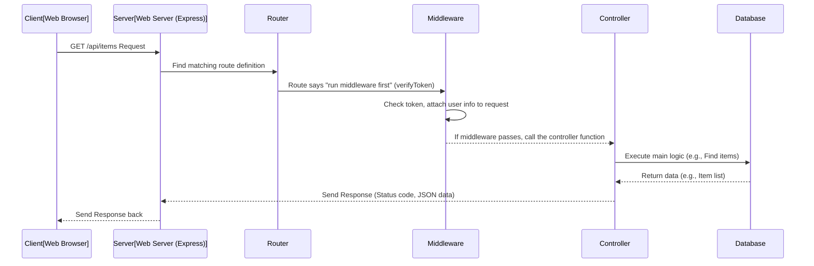

# Chapter 7: Server API Structure

Welcome to the final technical chapter of our tutorial! In the previous chapters, we've built the fundamental pieces of our Inventory Management System: the blueprints for our data ([Chapter 1: User Data Model](01_user_data_model.md), [Chapter 2: Inventory Data Model](02_inventory_data_model.md)), the secure flow for proving who you are ([Chapter 3: User Authentication & Authorization Flow](03_user_authentication_authorization_flow.md)) and managing that state on the client ([Chapter 4: Auth Context (Client State Management)](04_auth_context_client_state_management.md)), how our frontend navigates between different views ([Chapter 5: Client-Side Routing](05_client_side_routing.md)), and the interface admins use to interact with the inventory data on the frontend ([Chapter 6: Admin Inventory Interface](06_admin_inventory_interface.md)).

In [Chapter 6](06_admin_inventory_interface.md), we saw how the `AdminDashboard` component on the frontend makes requests to the "backend" or "server" to get the list of items, add new ones, update, or delete them. But what exactly happens _on the server_ when it receives these requests? How does it know what to do?

This is where the **Server API Structure** comes in. It's the **backbone of our backend application**, designed to receive and process all the requests coming from the frontend (or any other client). It's like the brain that decides how to handle incoming information and what response to send back.

## What Problem Does the Server API Structure Solve?

Imagine our server just sitting there, listening. When a request arrives (like "Hey server, give me the list of inventory items!"), the server needs a structured way to:

1.  Hear the request.
2.  Figure out exactly _what_ is being asked for (e.g., "get items," "login," "add user").
3.  Check if the request is allowed (e.g., "is this person logged in?").
4.  Run the specific code needed to fulfill the request (e.g., "go fetch items from the database").
5.  Get the result from that code.
6.  Send a structured response back to the client.

The Server API Structure provides this organized process. It's a system that routes incoming requests to the correct logic, ensuring everything is handled securely and efficiently.

## Core Use Case: Getting Inventory Items

Let's use a simple, concrete example we saw in [Chapter 6: Admin Inventory Interface](06_admin_inventory_interface.md): fetching the list of inventory items.

When the `AdminDashboard` component loads and calls `fetchItems()`, it sends a `GET` request to the server address `/api/items`. The server API structure is responsible for receiving this request and sending back the list of items from the database.

## Key Concepts of the Server API Structure

Our server API structure can be broken down into several interconnected pieces, working together like a well-oiled machine:

1.  **The Web Server (Express.js):** This is the foundation. It's the software that runs on our server machine, constantly listening for incoming requests over the internet. We use **Express.js**, a popular framework for Node.js, to easily set up our web server.
2.  **Connecting to the Database (Mongoose):** The server needs to talk to where our data lives. We use **Mongoose** to connect to our MongoDB database and interact with our data models ([Chapter 1](01_user_data_model.md), [Chapter 2](02_inventory_data_model.md)). The database connection is typically established once when the server starts.
3.  **Routes:** Think of these as specific **web addresses** or **endpoints** that the server recognizes. For example, `/api/items` might be the address for anything related to inventory items, and `/api/auth` for anything related to authentication (login, register). Different **HTTP methods** (GET, POST, PUT, DELETE) at the same address can trigger different actions.
4.  **Middleware:** These are functions that can run **in the middle** of processing a request, _before_ the final logic is executed. They are often used for tasks that apply to many routes, like checking if a user is authenticated ([Chapter 3](03_user_authentication_authorization_flow.md)) or logging details about the request.
5.  **Controllers:** These are functions that contain the **main business logic** for a specific request. If a request asks to "get all items," the controller function for that route will contain the code that uses Mongoose to query the database for items and prepare the data to be sent back.

These pieces work together in a specific order when a request arrives.

## How a Request Travels Through the Server (Conceptual Flow)

Let's trace the journey of a `GET /api/items` request from the frontend through our server structure:



In this flow:

1.  The `Client` sends the request to the `Server` (our Express app).
2.  The `Server` uses its **routing** system to find the definition for the `/api/items` route.
3.  The route definition says "Hey, before you run the main logic, run this `Middleware` first" (like our `verifyToken` middleware from [Chapter 3](03_user_authentication_authorization_flow.md)).
4.  The `Middleware` does its job (checks the token). If it passes, it calls `next()`, telling Express to move on. It might also add information to the request object (like `req.user`).
5.  Now the request reaches the **Controller** function associated with the route.
6.  The `Controller` contains the code to perform the action. For `GET /api/items`, it interacts with the `Database` (using Mongoose) to get the items.
7.  The `Database` returns the requested data.
8.  The `Controller` formats the data and sends a `Response` back to the `Server`.
9.  The `Server` sends the final `Response` back to the `Client`.

If any step fails (e.g., middleware finds an invalid token, controller encounters a database error), that step can stop the process and send an error response back early.

## How it Looks in Code

Let's look at the key server files and how they fit into this structure.

### 1. The Entry Point: `server/server.js`

This is where our server application starts. It sets up Express, connects to the database, and defines the main "base" routes for different parts of our API (like `/api/auth` and `/api/items`).

```javascript
// Import necessary packages
import mongoose from "mongoose";
import dotenv from "dotenv";
import express from "express";
import cors from "cors";
// ... other imports ...

// Import our route files
import authRoutes from "./routes/authRoutes.js";
import itemRoutes from "./routes/itemRoutes.js";

// Configure dotenv (loads environment variables like DB connection string)
dotenv.config({ quiet: true });

// Set up Express app
const app = express();
app.use(express.json()); // Middleware to parse JSON request bodies
app.use(cors()); // Middleware to allow cross-origin requests from frontend

// --- Define Main Route Paths ---
// When a request comes to /api/auth, send it to authRoutes
app.use("/api/auth", authRoutes);
// When a request comes to /api/items, send it to itemRoutes
app.use("/api/items", itemRoutes);
// ... add other base routes here ...

// Default route for testing
app.get("/", (req, res) => res.send("API is running..."));

// Database connection and Server start logic
const PORT = process.env.PORT || 5000;
const MONGO_URI = process.env.MONGO_URI;

mongoose
  .connect(MONGO_URI)
  .then(() => {
    // Start the server ONLY after database connection is successful
    app.listen(PORT, () => console.log(`Server listening on port ${PORT}...`));
  })
  .catch((err) => console.log("MongoDB Connection error!!!\n", err));
```

**Explanation:**

- We import Express (`express`) and `cors` middleware. `express.json()` is a built-in middleware that helps us read JSON data sent in the request body (used for POST/PUT requests).
- We import our specific route files (`authRoutes`, `itemRoutes`). These files will define the _sub-paths_ and handlers within `/api/auth` and `/api/items`.
- `app.use("/api/auth", authRoutes);` is a key line. It says: "For any request path starting with `/api/auth`, please hand it off to the `authRoutes` module to handle the rest of the path." Similarly, requests starting with `/api/items` go to `itemRoutes`. This helps organize our routes into logical groups.
- The database connection (`mongoose.connect`) is set up. The server only starts listening for requests (`app.listen`) _after_ the database connection is established, preventing issues where route handlers try to access the database before it's ready.

### 2. Route Definitions: `server/routes/itemRoutes.js`

This file defines the specific endpoints related to inventory items, maps them to HTTP methods (GET, POST, etc.), links them to middleware, and finally points them to the correct controller functions.

```javascript
// Import packages
import express from "express";

// Import middleware
import { verifyToken } from "../middleware/authMiddleware.js"; // Our auth check

// Import controller functions for items
import {
  createItem,
  getAllItems,
  updateItem,
  deleteItem,
} from "./../controller/itemController.js";

// Create an Express Router instance
const router = express.Router();

// --- Define Specific Item Routes ---

// GET /api/items/ - Fetch all items
// This route uses the verifyToken middleware before calling getAllItems
router.get("/", verifyToken, getAllItems);

// POST /api/items/ - Create a new item
// This route uses verifyToken middleware before calling createItem
router.post("/", verifyToken, createItem);

// PUT /api/items/:id - Update an item by ID
// ":id" is a URL parameter. Uses verifyToken before updateItem
router.put("/:id", verifyToken, updateItem);

// DELETE /api/items/:id - Delete an item by ID
// ":id" is a URL parameter. Uses verifyToken before deleteItem
router.delete("/:id", verifyToken, deleteItem);

// --- Testing route ---
router.get("/test", verifyToken, (req, res) => {
  res.json({
    message: "Access granted to Inventory route test",
    user: req.user, // This comes from verifyToken middleware
  });
});

// Export this router to be used in server.js
export default router;
```

**Explanation:**

- We import `express` and create a `router` object. This object is like a mini-Express app specifically for these related routes.
- We import the `verifyToken` middleware from [Chapter 3](03_user_authentication_authorization_flow.md).
- We import the specific controller functions (`createItem`, `getAllItems`, etc.) that will handle the actual work for each route.
- `router.get("/", verifyToken, getAllItems);`: This line defines the `GET` request handler for the path `/` _within this router_. Since this router is mounted at `/api/items` in `server.js`, the full path is `GET /api/items`.
  - `verifyToken` is listed _before_ `getAllItems`. This is the middleware! When a request hits this route, Express runs `verifyToken` first.
  - If `verifyToken` calls `next()`, Express then runs the `getAllItems` controller function.
- Other lines define similar routes for `POST`, `PUT`, and `DELETE` requests, including the `:id` URL parameter which is used to specify _which_ item to update or delete. All inventory management routes here use `verifyToken` because they require a logged-in user.

### 3. Middleware: `server/middleware/authMiddleware.js`

As discussed in [Chapter 3](03_user_authentication_authorization_flow.md), this file contains functions that run before the main route handler. `verifyToken` is our primary example.

```javascript
// Import packages
import jwt from "jsonwebtoken";
// ... other imports ...

// Get JWT Secret
const JWT_SECRET = process.env.JWT_SECRET; // Loaded from .env

// Middleware function to verify the token
export const verifyToken = (req, res, next) => {
  // Get token from headers (Authorization: Bearer TOKEN)
  const authHeader = req.headers.authorization;

  if (!authHeader || !authHeader.startsWith("Bearer ")) {
    // If no token, send 401 Unauthorized error
    return res
      .status(401)
      .json({ message: "Access denied. No token provided." });
  }

  // Extract the token string
  const token = authHeader.split(" ")[1];

  try {
    // Verify the token using the secret
    const decoded = jwt.verify(token, JWT_SECRET);
    // If valid, add the decoded info (user id, role) to the request object
    req.user = decoded;
    // Call next() to proceed to the next middleware or route handler
    next();
  } catch (err) {
    // If token is invalid or expired, send 401 Unauthorized error
    return res.status(401).json({ message: err.message });
  }
};
```

**Explanation:**

- `verifyToken` is a function that takes `req`, `res`, and `next` as arguments, which is the standard signature for Express middleware.
- It checks for the token in the request headers.
- It uses `jwt.verify` to validate the token.
- If valid, it attaches the user's ID and role (decoded from the token) to `req.user`. This is how the controller functions ([Chapter 6](06_admin_inventory_interface.md)) can know who the logged-in user is and check their role for authorization (`req.user.role !== "admin"`).
- `next()` is called to allow the request to continue down the chain (to the controller).
- If verification fails, it sends a `401 Unauthorized` response and _doesn't_ call `next()`, stopping the request flow.

### 4. Controllers: `server/controller/itemController.js`

This file contains the functions that execute the core logic. Let's look at the `getAllItems` function, which handles our `GET /api/items` request.

```javascript
// Import our Inventory Model blueprint
import Inventory from "./../models/Inventory.js";
// ... other imports ...

// --- GET ITEMS Controller ---
export const getAllItems = async (req, res) => {
  // Get potential filters and sort options from query parameters (e.g., /api/items?search=laptop&sort=price)
  const { search, category, minPrice, maxPrice, ...otherFilters } = req.query;

  // Build a query object for the database based on filters
  const query = {};
  if (search) query.name = { $regex: search, $options: "i" }; // Case-insensitive search by name
  if (category) query.category = { $regex: category, $options: "i" }; // Case-insensitive search by category
  // ... add logic for other filters like minPrice, maxPrice, etc. ...

  // Get sort options (e.g., ?sort=price&order=asc)
  const sort = req.query.sort || "createdAt"; // Default sort by creation date
  const order = req.query.order === "asc" ? 1 : -1; // 1 for ascending, -1 for descending
  const sortOptions = { [sort]: order };

  try {
    // Use Mongoose to find items matching the query
    // .populate() fetches the 'createdBy' user's name and email
    // .sort(), .skip(), .limit() handle pagination/sorting
    const items = await Inventory.find(query)
      .populate("createdBy", "name email")
      .sort(sortOptions);
    // .skip(...) // Add pagination logic
    // .limit(...) // Add pagination logic
    // Send the items back as a JSON response with 200 status
    res.status(200).json({
      // totalItems: total, // Add total count for pagination
      // currentPage: Number(page), // Add current page
      // totalPages: Math.ceil(total / limit), // Add total pages
      items, // Send the actual list of items
    });
  } catch (err) {
    // If an error occurs, send a 500 Internal Server Error response
    return res.status(500).json({ message: err.message });
  }
};

// ... Other controller functions like createItem, updateItem, deleteItem ...
// These would also interact with the Inventory model and send responses
```

**Explanation:**

- We import the `Inventory` model (our blueprint from [Chapter 2](02_inventory_data_model.md)), which allows us to interact with the database.
- `getAllItems` is an `async` function that takes `req` (request) and `res` (response) objects.
- It accesses `req.query` to get any URL parameters sent by the client for filtering/sorting.
- It builds a `query` object that Mongoose understands, based on these parameters.
- `await Inventory.find(query)` uses our Mongoose `Inventory` model to search the database.
  - `.populate("createdBy", "name email")` is important! This tells Mongoose to look up the user document referenced by the `createdBy` field (from [Chapter 2](02_inventory_data_model.md)) and include its `name` and `email` in the result, instead of just the user's ID. This is how our frontend can display "Created by: [User Name]".
  - `.sort()` applies the sorting specified by the client.
- `res.status(200).json({...});` sends the response back to the client. `res.status()` sets the HTTP status code (200 means success), and `json()` sends the data as JSON.
- The `catch` block handles any errors during the process (like database issues) and sends a `500 Internal Server Error` response.

Other controller functions (`createItem`, `updateItem`, `deleteItem`) follow a similar pattern: they get data from `req.body` (for POST/PUT) or `req.params` (for PUT/DELETE IDs), use the `Inventory` model to perform database operations (create, update, delete), and send appropriate responses (200 for success, 400/404/500 for errors). They also include the authorization check `if (req.user.role !== "admin") { ... return res.status(403)... }` which is possible because `verifyToken` middleware ran first and added `req.user`.

## Summary: The Server API Flow

In short, the Server API Structure organizes how the server receives, processes, and responds to requests:

1.  **Server (`server.js`):** Listens, connects to DB, routes requests to base paths (`/api/auth`, `/api/items`).
2.  **Routers (`routes/*.js`):** Define specific endpoints and link them to middleware and controllers.
3.  **Middleware (`middleware/*.js`):** Run before controllers for common tasks (like authentication). They can stop requests or add information to `req`.
4.  **Controllers (`controller/*.js`):** Contain the core logic, interact with the database using Models ([Chapter 1](01_user_data_model.md), [Chapter 2](02_inventory_data_model.md)), and prepare the final response.
5.  **Models (`models/*.js`):** Blueprints used by controllers to talk to the database.

This structure provides a clean, maintainable, and scalable way to build the backend of our application.

## Conclusion

We've now explored the Server API Structure, understanding how Express.js acts as our web server, how routes guide incoming requests, how middleware like `verifyToken` intercepts requests for processing (especially authentication and authorization), and how controllers execute the specific logic, interacting with our database models. This organized backend allows our frontend, with its [Admin Inventory Interface](06_admin_inventory_interface.md), [Client-Side Routing](05_client_side_routing.md), and [Auth Context](04_auth_context_client_state_management.md), to communicate effectively and securely.

This concludes our deep dive into the technical architecture of the Inventory Management System. You now have a foundational understanding of the key concepts and how they work together to create a functional web application.
