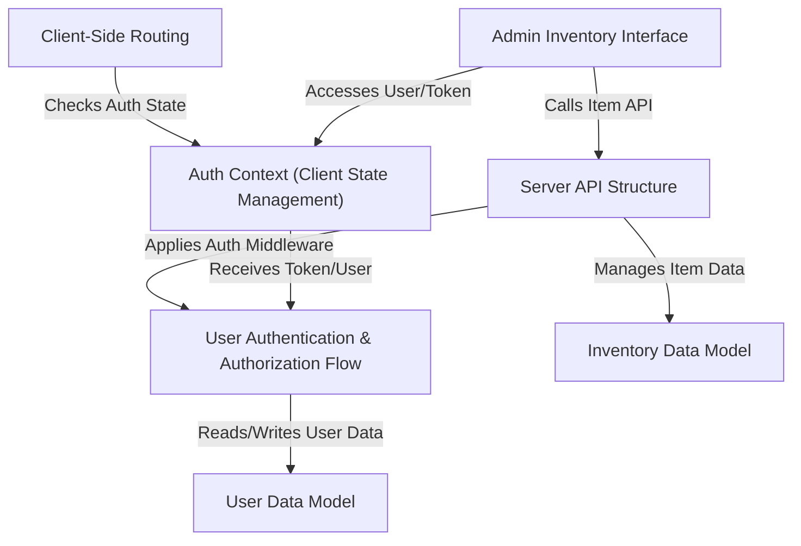

# Tutorial: Inverntory-Management-System

This project is a simple **Inventory Management System**. It allows users to
track items in an inventory. It includes features for **user authentication**
(login, registration), maintaining a list of _inventory items_, and
restricting certain actions (like adding or deleting items) to users with an
'_admin_' **role**. The system uses a web interface to interact with a
backend server.

## Visual Overview

## Chapters

1. [User Data Model
   ](01_user_data_model.md)
2. [Inventory Data Model
   ](02_inventory_data_model.md)
3. [User Authentication & Authorization Flow
   ](03_user_authentication_authorization_flow.md)
4. [Auth Context (Client State Management)
   ](04_auth_context_client_state_management.md)
5. [Client-Side Routing
   ](05_client_side_routing.md)
6. [Admin Inventory Interface
   ](06_admin_inventory_interface.md)
7. [Server API Structure
   ](07_server_api_structure.md)
